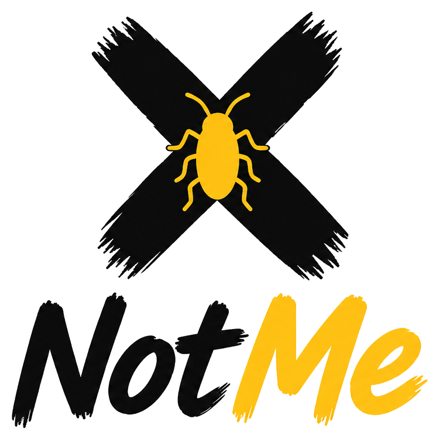

<div align="center">
  
</div>

# NotMe

**Uber for Weird Problems** — an on-demand marketplace that connects people with the awkward, gross, or intimidating tasks they'd rather not do themselves to nearby Heroes who'll handle it for them. The current MVP is scoped to a single problem: **cockroach removal** 🪳.

## Tech Stack

| Layer | Tech |
| --- | --- |
| Framework | React Native + Expo (SDK 54) |
| Navigation | Expo Router |
| Styling | NativeWind |
| Client state | Zustand |
| Server state | TanStack Query |
| Backend | Supabase (Auth / Database / Storage / Realtime) |
| Language | TypeScript |

## Getting Started

```bash
npm install
cp .env.example .env
# Fill in EXPO_PUBLIC_SUPABASE_URL and EXPO_PUBLIC_SUPABASE_ANON_KEY in .env

npm run start   # or: npm run ios / npm run android / npm run web
```

Other useful scripts:

```bash
npm run lint     # eslint
npm run format   # prettier --write
```

## Project Structure

```
app/         # Expo Router screens & routes
components/  # Shared, reusable UI components
features/    # Feature-specific components & logic
hooks/       # Custom React hooks
services/    # Supabase clients & data access
stores/      # Zustand stores (client state)
types/       # Shared TypeScript types
constants/   # App-wide constants
assets/      # Images, fonts, logos
docs/        # Supporting documentation
```

## Demo

> 📹 Demo video coming soon.

## Documentation

For deeper detail, see:

- [PRODUCT.md](PRODUCT.md) — product vision, target users, and feature specs (source of truth)
- [DESIGN.md](DESIGN.md) — design system, colors, typography, and copy tone
- [CLAUDE.md](CLAUDE.md) — development rules and conventions
- [TODO.md](TODO.md) — current progress and roadmap
